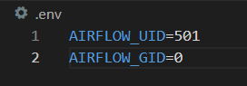
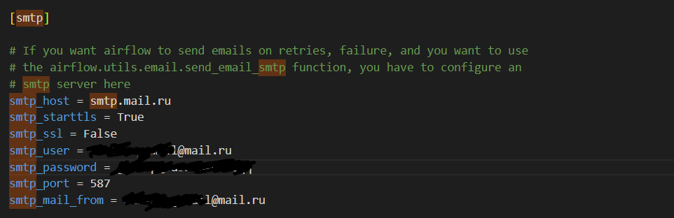
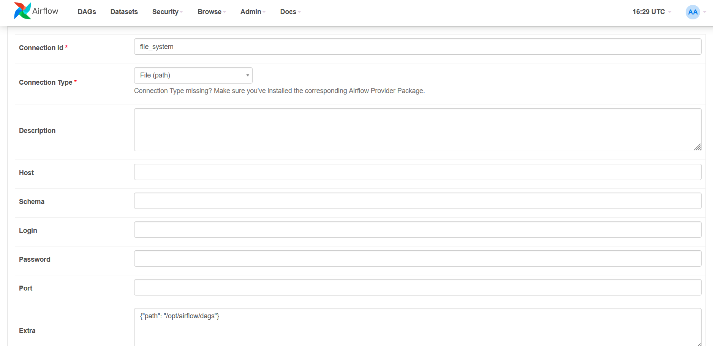
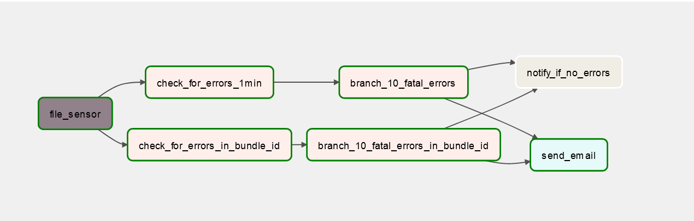

<h1>Airflow project</h1>

Create logs directory. <br />
Add a .env file with following contents:



Run ```docker-compose up airflow-init```
Then ```docker-compose up```

It is also neccessary to edit the airflow.cfg file which is located in config directory



<h2>Accessing the airflow:</h2>
Connect to localhost:8080 <br />
user: airflow <br />
password: airflow

<h3>Connections</h3>
Add the following connections:



<h3>About the dag</h3>



Alright so general idea is that we receive csv files with app data and we have to make a pipeline that has two criteria:
- make an alert if there are more than 10 fatal errors in less than a minute
- make an alert if there are more than 10 fatal errors in less than an hour for each unique bundle_id

To make that possible i have taken the following steps:
- created a file sensor which looks for csv files in our dag folder
- made two parallel tasks, one validates the first condition, the second one another accordingly
- after the validation is complete, there can be no errors, or some errors found, that's why I've implemented the branchOperator which returns one of the next tasks as a result of a boolean expression. In it's turn, the boolean expression is passed to the task through the xcom.
- in the end we can either have a notification that there are no errors or receive a email that there are actually some errors. We can also have both of outcomes, it depends on the data.

<h3>Note</h3>
I didnt include the data.csv file for project size reasons(570mb).